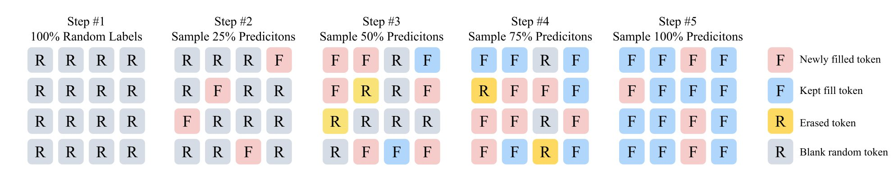

# GRN: Generative Refinement Networks

[](https://arxiv.org/abs/2604.13030)
[](LICENSE)
[](https://www.python.org/)
[](https://pytorch.org/)
[](https://github.com/MGenAI/GRN)

This is the official implementation of the paper **Generative Refinement Networks for Visual Synthesis**. Neither diffusion nor autoregressive — GRN is a third way. 🧠 Refines globally like an artist. ⚡ Generates adaptively by complexity. 🏆 New SOTA across image & video. The visual generation paradigm just got rewritten.

---

## 📋 Table of Contents

- [🌟 Introduction](#-introduction)
- [📑 Open-Source Plan](#-open-source-plan)
- [🛠️ Installation](#️-installation)
- [🖼️ Class-to-Image](#️-class-to-image)
  - [Dataset](#dataset)
  - [Training](#training)
  - [Evaluation](#evaluation)
- [📧 Contact](#-contact)
- [🤗 Acknowledgements](#-acknowledgements)
- [📝 Citation](#-citation)

---

## 🌟 Introduction

Diffusion models dominate visual generation but they allocate uniform computational effort to samples with varying levels of complexity. Autoregressive (AR) models are complexity-aware, as evidenced by their variable likelihoods, but suffer from lossy tokenization and error accumulation.

We introduce **Generative Refinement Networks (GRN)**, a new visual synthesis paradigm that addresses these issues:
- **Near-lossless tokenization** via Hierarchical Binary Quantization (HBQ)
- **Global refinement mechanism** that progressively perfects outputs like a human artist
- **Entropy-guided sampling** for complexity-aware, adaptive-step generation

GRN achieves state-of-the-art results on ImageNet reconstruction and class-conditional generation, and scales effectively to text-to-image and text-to-video tasks.

<figure align="center">
  <figcaption><strong><em>Generative Refinement Framework</em></strong></figcaption>
  
</figure>

<p align="center">
Starting from a random token map, GRN randomly selects more predictions at each step and refines all input tokens. For example, compared to the second step, the third step filled six new tokens (<span style="color: rgb(220, 120, 117);">pink</span>), kept two tokens (<span style="color: rgb(88, 160, 227);">blue</span>), erased two tokens (<span style="color: rgb(240, 180, 40);">yellow</span>), and left six tokens blank (<span style="color: rgb(128, 138, 151);">gray</span>).
</p>

<figure align="center">
  <figcaption><strong><em>Class-to-Image Examples</em></strong></figcaption>
  
</figure>

<figure align="center">
  <figcaption><strong><em>Text-to-Image Examples</em></strong></figcaption>
  
</figure>

<figure align="center">
  <figcaption><strong><em>Text-to-Video Examples</em></strong></figcaption>
  <video src="https://github.com/user-attachments/assets/8ce16018-0f86-4dfc-b51b-69075e8d0f15" width="100%" controls autoplay muted loop playsinline></video>
</figure>

---

## 📑 Open-Source Plan

GRN adopts a minimalist and self-contained design. This implementation is in PyTorch + GPU.

| Task | Checkpoints | Inference Code | Training Code |
|------|:-----------:|:--------------:|:-------------:|
| T2V  |     ⬜      |       ⬜        |      ✅       |
| T2I  |     ⬜      |       ⬜        |      ✅       |
| C2I  |     ⬜      |       ✅        |      ✅       |

---

## 🛠️ Installation

### Step 1: Clone the repository
```bash
git clone https://github.com/MGenAI/GRN
cd GRN
```

### Step 2: Create conda environment
A suitable [conda](https://conda.io/) environment named `GRN` can be created and activated with:
```bash
conda env create -f environment.yaml
conda activate GRN
```

### Troubleshooting
If you get `undefined symbol: iJIT_NotifyEvent` when importing `torch`, simply:
```bash
pip uninstall torch
pip install torch==2.5.1 --index-url https://download.pytorch.org/whl/cu124
```
Check this [issue](https://github.com/conda/conda/issues/13812#issuecomment-2071445372) for more details.

---

## 🖼️ Class-to-Image

### Dataset
Download [ImageNet](http://image-net.org/download) dataset, and place it in your `IMAGENET_PATH`.

### Training

All training scripts are located in `scripts/c2i/`. We suggest using 8x80GB GPUs for most models.

| Model | Training Script | GPUs Required |
|-------|:-------------:|:-------------:|
| GRN_ind_B | `bash scripts/c2i/train_GRN_ind_B.sh` | 8x80GB |
| GRN_bit_B | `bash scripts/c2i/train_GRN_bit_B.sh` | 8x80GB |
| GRN_ind_L | `bash scripts/c2i/train_GRN_ind_L.sh` | 8x80GB |
| GRN_ind_H | `bash scripts/c2i/train_GRN_ind_H.sh` | 16x80GB |
| GRN_ind_G | `bash scripts/c2i/train_GRN_ind_G.sh` | 32x80GB |

### Evaluation

PyTorch pre-trained models are available [here]().

All evaluation scripts are located in `scripts/c2i/`. We suggest using 8x80GB vRAM GPUs.

| Model | Evaluation Script |
|-------|:--------------:|
| GRN_ind_B | `bash scripts/c2i/eval_GRN_ind_B.sh` |
| GRN_bit_B | `bash scripts/c2i/eval_GRN_bit_B.sh` |
| GRN_ind_L | `bash scripts/c2i/eval_GRN_ind_L.sh` |
| GRN_ind_H | `bash scripts/c2i/eval_GRN_ind_H.sh` |
| GRN_ind_G | `bash scripts/c2i/eval_GRN_ind_G.sh` |

We use [torch-fidelity](https://github.com/LTH14/torch-fidelity) to evaluate FID and IS against a reference image folder or statistics. We use the JiT's pre-computed reference stats under `grn/utils_c2i/fid_stats`.

---

## 📧 Contact

If you are interested in scaling GRN for image generation / image editing / video generation / video editing / unified model directions, please feel free to reach out!

**📧 Email:** [hanjian.thu123@bytedance.com](mailto:hanjian.thu123@bytedance.com)

---

## 🤗 Acknowledgements

- Thanks to [JiT](https://github.com/LTH14/JiT), [Infinity](https://github.com/FoundationVision/Infinity) and [InfinityStar](https://github.com/FoundationVision/InfinityStar) for their wonderful work and codebase!

---

## 📝 Citation

If you find our work useful, please consider citing:

```bibtex
@misc{han2026grn,
      title={Generative Refinement Networks for Visual Synthesis}, 
      author={Jian Han and Jinlai Liu and Jiahuan Wang and Bingyue Peng and Zehuan Yuan},
      year={2026},
      eprint={2604.13030},
      archivePrefix={arXiv},
      primaryClass={cs.CV},
      url={https://arxiv.org/abs/2604.13030}, 
}
```
