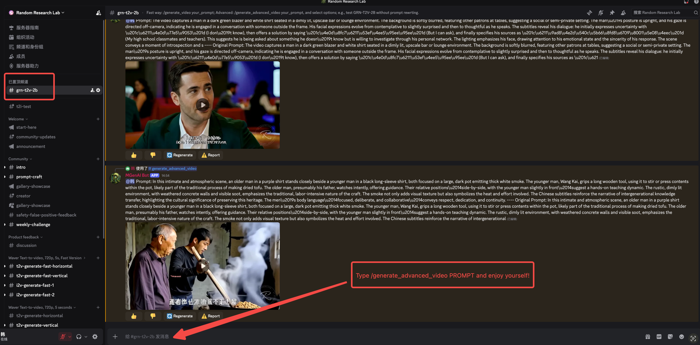

# GRN: Generative Refinement Networks

[](https://arxiv.org/abs/2604.13030)
[](https://mgenai.github.io/GRN/)
[](https://huggingface.co/bytedance-research/GRN)
[](https://huggingface.co/spaces/hanjian/GRN)
[](LICENSE)
[](https://github.com/MGenAI/GRN)

---

## 📋 Table of Contents

- [🌟 Introduction](#-introduction)
- [✨ Gallery](#-gallery)
- [🚀 Demo](#-demo)
- [📦 Model Zoo](#-model-zoo)
- [🛠️ Installation](#️-installation)
- [🖼️ Class-to-Image](#️-class-to-image)
  - [Dataset](#dataset)
  - [Training](#training)
  - [Evaluation](#evaluation)
- [🎨 Text-to-Image](#-text-to-image)
  - [Inference](#inference)
- [🎬 Text-to-Video](#-text-to-video)
  - [Inference](#inference-1)
- [📧 Contact](#-contact)
- [🤗 Acknowledgements](#-acknowledgements)
- [📝 Citation](#-citation)

---

## 🌟 Introduction

This is the official implementation of the paper **Generative Refinement Networks for Visual Synthesis**. Neither diffusion nor autoregressive — GRN is a third way. 🧠 Refines globally like an artist. ⚡ Generates adaptively by complexity. 🏆 New SOTA across image & video. The visual generation paradigm just got rewritten.

Diffusion models dominate visual generation but they allocate uniform computational effort to samples with varying levels of complexity. Autoregressive (AR) models are complexity-aware, as evidenced by their variable likelihoods, but suffer from lossy tokenization and error accumulation.

We introduce **Generative Refinement Networks (GRN)**, a new visual synthesis paradigm that addresses these issues:
- **Near-lossless tokenization** via Hierarchical Binary Quantization (HBQ)
- **Global refinement mechanism** that progressively perfects outputs like a human artist
- **Entropy-guided sampling** for complexity-aware, adaptive-step generation

GRN achieves state-of-the-art results on ImageNet reconstruction and class-conditional generation, and scales effectively to text-to-image and text-to-video tasks.

---

<figure align="center">
  <figcaption><strong><em>Generative Refinement Framework</em></strong></figcaption>
  
</figure>

<p align="center">
Starting from a random token map, GRN randomly selects more predictions at each step and refines all input tokens. For example, compared to the second step, the third step filled six new tokens (<span style="color: rgb(220, 120, 117);">pink</span>), kept two tokens (<span style="color: rgb(88, 160, 227);">blue</span>), erased two tokens (<span style="color: rgb(240, 180, 40);">yellow</span>), and left six tokens blank (<span style="color: rgb(128, 138, 151);">gray</span>).
</p>

---

## ✨ Gallery

### GRN-8B Text-to-Video Examples

<div align="center">
  <table style="border-spacing: 6px; margin: auto;">
    <tr>
      <td style="padding: 2px;"><video src="https://github.com/user-attachments/assets/6ce844dc-3185-4239-bcf1-d72ff20a3031" width="33%" autoplay muted loop playsinline></video></td>
      <td style="padding: 2px;"><video src="https://github.com/user-attachments/assets/1697066e-f00f-4e23-a55c-c6af5948c4af" width="33%" autoplay muted loop playsinline></video></td>
      <td style="padding: 2px;"><video src="https://github.com/user-attachments/assets/1023ea4d-d814-4be1-95f2-b1623de0f6bd" width="33%" autoplay muted loop playsinline></video></td>
    </tr>
    <tr>
      <td style="padding: 2px;"><video src="https://github.com/user-attachments/assets/6244dae4-f480-408a-ac3d-19e4d1ef0a2d" width="33%" autoplay muted loop playsinline></video></td>
      <td style="padding: 2px;"><video src="https://github.com/user-attachments/assets/5aefc8d2-bc99-48e4-bd1c-9b3077c9c35e" width="33%" autoplay muted loop playsinline></video></td>
      <td style="padding: 2px;"><video src="https://github.com/user-attachments/assets/014e8bb4-04a7-4fa4-a597-d0dfbcc23e02" width="33%" autoplay muted loop playsinline></video></td>
    </tr>
    <tr>
      <td style="padding: 2px;"><video src="https://github.com/user-attachments/assets/6bde1f2e-cebe-4f47-9eac-4fe817c3ebc7" width="33%" autoplay muted loop playsinline></video></td>
      <td style="padding: 2px;"><video src="https://github.com/user-attachments/assets/b9957300-fa98-411c-83d5-f972621245ad" width="33%" autoplay muted loop playsinline></video></td>
      <td style="padding: 2px;"><video src="https://github.com/user-attachments/assets/d07cef92-3eec-4e7c-93da-f6c6a8dc1658" width="33%" autoplay muted loop playsinline></video></td>
    </tr>
  </table>
</div>

---

### GRN-8B Image-to-Video Examples

<div align="center">
  <table style="border-spacing: 6px; margin: auto;">
    <tr>
      <td style="padding: 2px;"><video src="https://github.com/user-attachments/assets/527f94b0-4b04-4cbb-a86d-9f5ae05fab67" width="33%" autoplay muted loop playsinline></video></td>
      <td style="padding: 2px;"><video src="https://github.com/user-attachments/assets/0b63a9ed-2940-402f-8339-db0d05a09525" width="33%" autoplay muted loop playsinline></video></td>
      <td style="padding: 2px;"><video src="https://github.com/user-attachments/assets/8d108a5f-1414-43ca-af6b-8862640741e5" width="33%" autoplay muted loop playsinline></video></td>
    </tr>
    <tr>
      <td style="padding: 2px;"><video src="https://github.com/user-attachments/assets/64cd45a9-0c2f-4926-bcc0-b8a0a939ae54" width="33%" autoplay muted loop playsinline></video></td>
      <td style="padding: 2px;"><video src="https://github.com/user-attachments/assets/6c31c9e5-0742-4416-925c-16c39bc5a03a" width="33%" autoplay muted loop playsinline></video></td>
      <td style="padding: 2px;"><video src="https://github.com/user-attachments/assets/4e966b46-6107-4ffe-a24b-37dc3c8461dd" width="33%" autoplay muted loop playsinline></video></td>
    </tr>
    <tr>
      <td style="padding: 2px;"><video src="https://github.com/user-attachments/assets/56ce2dc1-3b64-4493-ab27-b2ba273c64ef" width="33%" autoplay muted loop playsinline></video></td>
      <td style="padding: 2px;"><video src="https://github.com/user-attachments/assets/ef45a3f4-8fb2-4bb5-885e-19645e5a0fb5" width="33%" autoplay muted loop playsinline></video></td>
      <td style="padding: 2px;"><video src="https://github.com/user-attachments/assets/98e3fbb0-9a54-49e6-8cec-96a42d0634e6" width="33%" autoplay muted loop playsinline></video></td>
    </tr>
  </table>
</div>

### GRN-2B Class-to-Image Examples
<figure align="center">
  <!-- <figcaption><strong><em>GRN-2B Class-to-Image Examples</em></strong></figcaption> -->
  
</figure>

### GRN-2B Text-to-Image Examples
<figure align="center">
  <!-- <figcaption><strong><em>GRN-2B Text-to-Image Examples</em></strong></figcaption> -->
  
</figure>

---

## 🚀 Demo

### 🖼️ Text-to-Image
Try our interactive Text-to-Image demo on 🤗 Hugging Face Space:

**[GRN T2I Demo](https://huggingface.co/spaces/hanjian/GRN)**

Experience the power of Generative Refinement Networks firsthand by generating images from text prompts directly in your browser!

---

### 🎬 Text-to-Video
Try our interactive Text-to-Video demo on Discord:

[](http://opensource.bytedance.com/discord/invite)


<figure align="center">
  <figcaption><strong><em>T2V Demo on Discord</em></strong></figcaption>
  
</figure>

---

## 📦 Model Zoo

| Model | Checkpoints |
|-------|:-----------:|
| **Tokenizers** | ✅ [ImageNet Tokenizer](https://huggingface.co/bytedance-research/GRN/blob/main/HBQ_image_tokenizer_16dim_M4.ckpt)<br>✅ [Joint Image/Video Tokenizer](https://huggingface.co/bytedance-research/GRN/blob/main/HBQ_tokenizer_64dim_M4.ckpt) |
| **GRN_ind_C2I** | ✅ [B](https://huggingface.co/bytedance-research/GRN/blob/main/GRN_ind_B_ep599.pth)<br>⬜ L (TBD)<br>⬜ H (TBD)<br>⬜ G (TBD) |
| **GRN_bit_T2I** | ✅ [GRN_T2I](https://huggingface.co/bytedance-research/GRN/blob/main/GRN_T2I_2B.pth) |
| **GRN_bit_T2V** | ✅ [GRN_T2V](https://huggingface.co/bytedance-research/GRN/blob/main/GRN_T2V_2B.pth) |

---

## 🛠️ Installation

### Step 1: Clone the repository
```bash
git clone https://github.com/MGenAI/GRN
cd GRN
```

### Step 2: Create conda environment
A suitable [conda](https://conda.io/) environment named `GRN` can be created and activated with:
```bash
conda env create -f environment.yaml
conda activate GRN
```

### Troubleshooting
If you get `undefined symbol: iJIT_NotifyEvent` when importing `torch`, simply:
```bash
pip uninstall torch
pip install torch==2.5.1 --index-url https://download.pytorch.org/whl/cu124
```
Check this [issue](https://github.com/conda/conda/issues/13812#issuecomment-2071445372) for more details.

---

## 🖼️ Class-to-Image

### Dataset
Download [ImageNet](http://image-net.org/download) dataset, and place it in your `IMAGENET_PATH`.

### Training

All training scripts are located in `scripts/c2i/`. We suggest using 8x80GB GPUs for most models.

| Model | Training Script | GPUs Required |
|-------|:-------------:|:-------------:|
| GRN_ind_B | `bash scripts/c2i/train_GRN_ind_B.sh` | 8x80GB |
| GRN_bit_B | `bash scripts/c2i/train_GRN_bit_B.sh` | 8x80GB |
| GRN_ind_L | `bash scripts/c2i/train_GRN_ind_L.sh` | 8x80GB |
| GRN_ind_H | `bash scripts/c2i/train_GRN_ind_H.sh` | 16x80GB |
| GRN_ind_G | `bash scripts/c2i/train_GRN_ind_G.sh` | 32x80GB |

### Evaluation

PyTorch pre-trained models are available [here](https://huggingface.co/bytedance-research/GRN/tree/main).

All evaluation scripts are located in `scripts/c2i/`. We suggest using 8x80GB vRAM GPUs.

| Model | Evaluation Script |
|-------|:--------------:|
| GRN_ind_B | `bash scripts/c2i/eval_GRN_ind_B.sh` |
| GRN_bit_B | `bash scripts/c2i/eval_GRN_bit_B.sh` |
| GRN_ind_L | `bash scripts/c2i/eval_GRN_ind_L.sh` |
| GRN_ind_H | `bash scripts/c2i/eval_GRN_ind_H.sh` |
| GRN_ind_G | `bash scripts/c2i/eval_GRN_ind_G.sh` |

We use [torch-fidelity](https://github.com/LTH14/torch-fidelity) to evaluate FID and IS against a reference image folder or statistics. We use the JiT's pre-computed reference stats under `grn/utils_c2i/fid_stats`.

---

## 🎨 Text-to-Image

### Inference

You can simply run `python3 t2iv_infer_simple.py` or use the following code:

```python
from PIL import Image
import torch
from grn_pipeline import GRNPipeline

# Load pipeline
pipeline = GRNPipeline.from_pretrained(hf_repo_id='bytedance-research/GRN', task='T2I',device='cpu')
pipeline = pipeline.to('cuda')

# Generate one image
result = pipeline(
    prompt="A cute cat playing in the garden",
    guidance_scale=3.0,
    temperature=1.1,
    complexity_aware_Tmin=10,
    complexity_aware_Tmax=50,
    complexity_aware_k = 0,
    complexity_aware_b = 50,
    complexity_aware_wp = 5,
    snr_shift = 1.,
    width=1024,
    height=1024,
    content_type='image',
    seed=42
)
image = result.images[0]
image.save('./generated_image.jpg')
```

---

## 🎬 Text-to-Video

### Inference

```python
from PIL import Image
import torch
from grn_pipeline import GRNPipeline

# Load pipeline
pipeline = GRNPipeline.from_pretrained(hf_repo_id='bytedance-research/GRN', task='T2V', device='cpu')
pipeline = pipeline.to('cuda')
  
# Generate one video
result = pipeline(
    prompt="Two women demonstrate a makeup product, applying it with a sponge while smiling and engaging with the camera in a bright, clean setting.",
    guidance_scale=4.0,
    temperature=1.0,
    complexity_aware_Tmin=10,
    complexity_aware_Tmax=50,
    complexity_aware_k = 0,
    complexity_aware_b = 50,
    complexity_aware_wp = 5,
    snr_shift = 1.,
    width=480,
    height=848,
    duration=2.,
    content_type='video',
    seed=42
)
video_file = result.videos[0]
```

---

## 📧 Contact

If you are interested in scaling GRN for image generation / image editing / video generation / video editing / unified model directions, please feel free to reach out!

**📧 Email:** [hanjian.thu123@bytedance.com](mailto:hanjian.thu123@bytedance.com)

---

## 🤗 Acknowledgements

- Thanks to [JiT](https://github.com/LTH14/JiT), [Infinity](https://github.com/FoundationVision/Infinity) and [InfinityStar](https://github.com/FoundationVision/InfinityStar) for their wonderful work and codebase!

---

## 📝 Citation

If you find our work useful, please consider citing:

```bibtex
@misc{han2026grn,
      title={Generative Refinement Networks for Visual Synthesis}, 
      author={Jian Han and Jinlai Liu and Jiahuan Wang and Bingyue Peng and Zehuan Yuan},
      year={2026},
      eprint={2604.13030},
      archivePrefix={arXiv},
      primaryClass={cs.CV},
      url={https://arxiv.org/abs/2604.13030}, 
}
```
